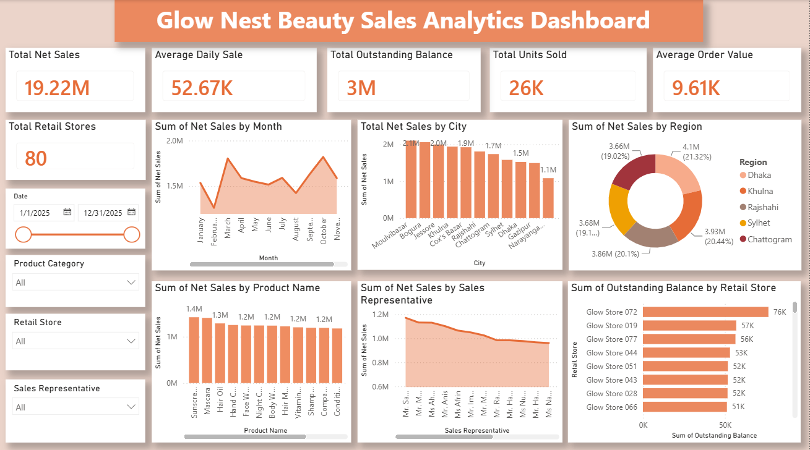

💄 GlowNest Beauty Sales Analytics Dashboard

📌 Project Overview

This project is an interactive Power BI Sales Dashboard developed using a simulated beauty products sales dataset. The dashboard provides a comprehensive overview of business performance by analyzing sales, product performance, regional performance, retail store performance, outstanding balances and sales representatives.

The objective of this project is to demonstrate data visualization, business intelligence, KPI reporting and dashboard design skills using Microsoft Power BI.

---

📊 Dashboard Preview

> 

---
🎯 Business Objectives

- Monitor overall sales performance
- Analyze monthly sales trends
- Compare sales across different cities and regions
- Identify top-performing products
- Evaluate sales representative performance
- Track outstanding customer balances
- Monitor retail store performance
- Provide interactive filtering for business analysis

---

📈 Key Performance Indicators (KPIs)

- 💰 Total Net Sales
- 📅 Average Daily Sales
- 🧾 Average Order Value (AOV)
- 📦 Total Units Sold
- 🏪 Total Retail Stores
- 💳 Total Outstanding Balance

---

📊 Dashboard Features

### Interactive Filters

- Date
- Product Category
- Retail Store
- Sales Representative

### Visualizations

- Monthly Net Sales Trend
- Net Sales by City
- Net Sales by Region
- Net Sales by Product
- Net Sales by Sales Representative
- Outstanding Balance by Retail Store

---
🛠️ Tools & Technologies

- Microsoft Power BI
- Microsoft Excel
- DAX (Data Analysis Expressions)
- Data Modeling
- Data Visualization

---

📂 Dataset

This project uses a simulated beauty products sales dataset created for portfolio and learning purposes.

The dataset includes information such as:

- Invoice ID
- Invoice Date
- Product Category
- Product Name
- Retail Store
- Sales Representative
- City
- Region
- Units Sold
- Unit Price
- Gross Sales
- Discount
- Net Sales
- Outstanding Balance

---

📚 Skills Demonstrated

- Dashboard Design
- KPI Development
- Business Analysis
- Sales Analytics
- DAX Measures
- Interactive Reporting
- Data Modeling
- Data Visualization

---

📌 Key Business Insights

- Monitor monthly sales performance and trends.
- Compare regional sales performance.
- Identify top-performing products.
- Evaluate sales representatives based on net sales.
- Analyze outstanding balances across retail stores.
- Enable dynamic business analysis through interactive filters.

---

🚀 Future Improvements

- Add Profit Margin Analysis
- Customer Segmentation
- Sales Forecasting
- Inventory Dashboard
- Executive Summary Page
- Drill-through Reports

---

👩‍💻 Author

Refaya Aftarin

Aspiring Data Analyst | Market Intelligence Professional

Skills:
- Power BI
- Excel
- SQL
- Python
- Data Visualization
- Business Intelligence

---

⭐ If you found this project interesting, feel free to explore the dashboard and share your feedback!
